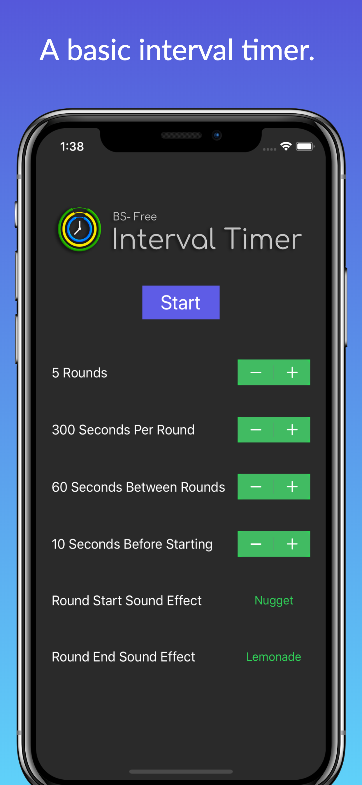
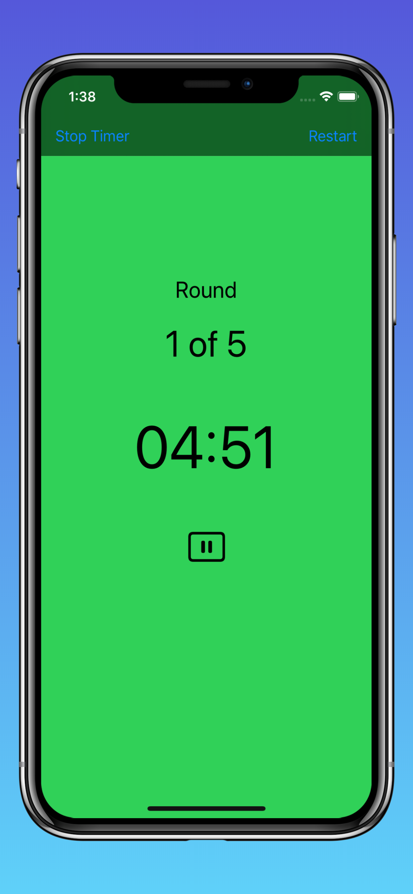
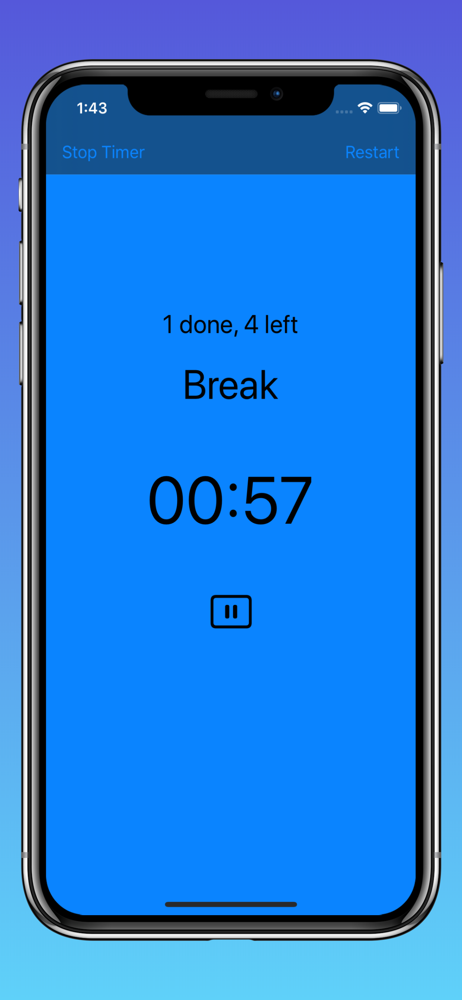
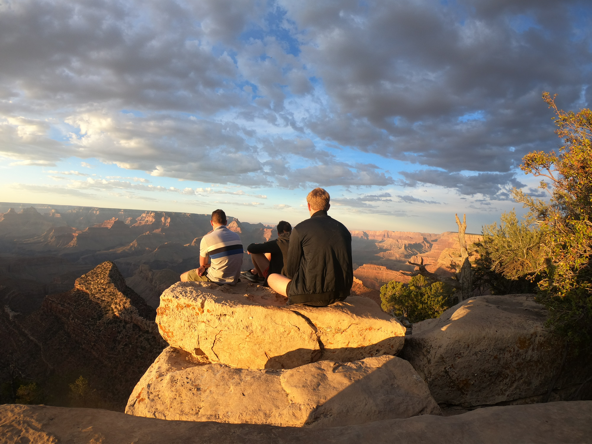
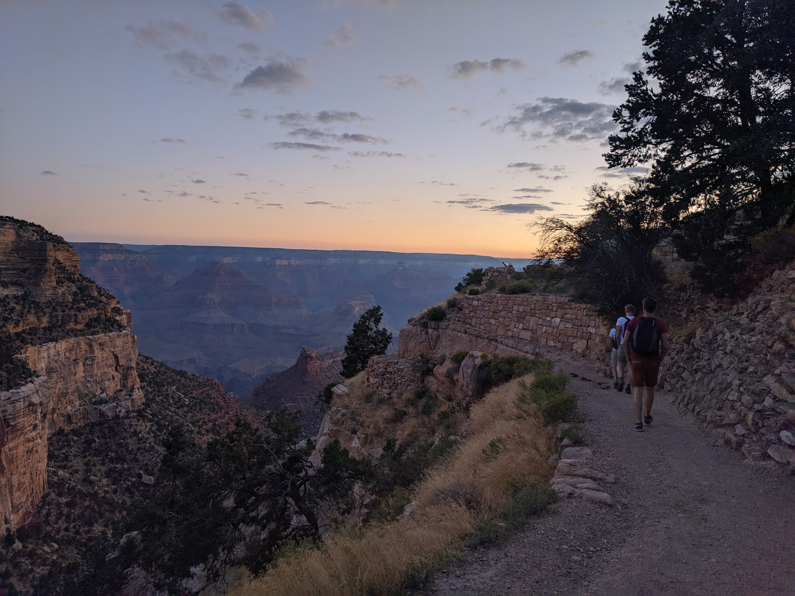

# My Experiments

This repository contains some code experiments and their corresponding notes and results. In addition, I am also listing some of my favorite publications here.

**Some of my favorite publications**

- Cubic Stylization [[November, 2019]](http://www.dgp.toronto.edu/projects/cubic-stylization/)

    This publication presents a 3D stylization algorithm that can turn a 3D input shape into the style of a cube while maintaining the content of the original shape. This article is playful, yet impressive.

    

- In Silico Labeling: Predicting Fluorescent Labels in Unlabeled Images [[April 12, 2018]](https://ai.googleblog.com/2018/04/seeing-more-with-in-silico-labeling-of.html)

    This paper is an impressive use-case of machine learning to transform images from transmitted light microscopy (cheap) into color-annotated images as typically observed with fluorescence microscopy (more expensive), potentially removing the need for expensive technology.

    

## Experiments

**Publish a Swift app to the iOS App Store [[January, 2020]](https://apps.apple.com/us/app/bs-free-interval-timer/id1492758790)**

I wanted to learn Swift to better understand how to serve edge devices when developing APIs or web-applications. Going through the stringent publishing process on the iOS app store proved to be useful in learning what reviewers look for and what makes a solid app. In addition, I got an ad-free workout timer out of it that I've been using on a daily basis!

**3D Ken Burns Effect from a Single Image [[September 12, 2019]](https://arxiv.org/abs/1909.05483)**

Simply put, this piece of research proposes an image transformation pipeline to convert a 2D image into a depthmap for the objects, before using the depthmap to generate '3D angles' to the objects. This technique can turn still 2D images into convincing 3D videos resembling a drone-shot video. With a little bit of help from [Ngrok](https://dashboard.ngrok.com/get-started) for port-forwarding, the [web-app](https://github.com/sniklaus/3d-ken-burns) can be run locally with a connection to a CodeLab GPU runtime. Although artefacts in the output videos are easily observable when pushing the boundaries, the results on some of my own images (below) will always blow my mind. 

On the left is the original 2D image, whereas the resulting gif is shown on the right.

**StyleGAN: A Style-Based Generator Architecture for Generative Adversarial Networks [[December 12, 2018]](http://stylegan.xyz/paper)**

Using the [StyleGAN TensorFlow implementation](https://github.com/NVlabs/stylegan), playing around with the latent vectorspace in the direction of age is easy. The predictions regarding 'me from the past' and 'future me' are pretty convincing, although clear artefacts are especially visible in hair.

